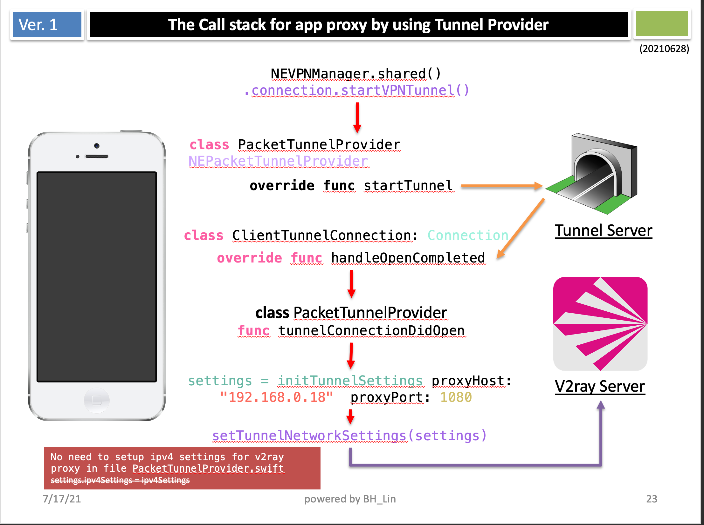

# SimpleTunnel: Customized Networking Using the NetworkExtension Framework

The SimpleTunnel project contains working examples of the four extension points provided by the Network Extension framework:

1. Packet Tunnel Provider

The Packet Tunnel Provider extension point is used to implemnt the client side of a custom network tunneling protocol that encapsulates network data in the form of IP packets. The PacketTunnel target in the SimpleTunnel project produces a sample Packet Tunnel Provider extension.

2. App Proxy Provider

The App Proxy Provider extension point is used to implement the client side of a custom network proxy protocol that encapsulates network data in the form of flows of application network data. Both TCP or stream-based and UDP or datagram-based flows of data are supported. The AppProxy target in the SimpleTunnel project produces a sample App Proxy Provider extension.

3. Filter Data Provider and Filter Control Provider

The two Filter Provider extension points are used to implement a dynamic, on-device network content filter. The Filter Data Provider extension is responsible for examining network data and making pass/block decisions. The Filter Data Provider extension sandbox prevents the extension from communicating over the network or writing to disk to prevent any leakage of network data. The Filter Control Provider extension can communicate using the network and write to the disk. It is responsible for updating the filtering rules on behalf of the Filter Data Provider extension.

The FilterDataProvider target in the SimpleTunnel project produces a sample Filter Data Provider extension. The FilterControlProvider target in the SimpleTunnel project produces a sample Filter Control Provider extension.e

All of the sample extensions are packaged into the SimpleTunnel app. 
The SimpleTunnel app contains code demonstrating how to configure and control the various types of Network Extension providers. 
The SimpleTunnel target in the SimpleTunnel project produces the SimpleTunnel app and all of the sample extensions.

The SimpleTunnel project contains both the client and server sides of a custom network tunneling protocol. 
The Packet Tunnel Provider and App Proxy Provider extensions implement the client side. 
The tunnel_server target produces a macOS command-line binary that implements the server side. 
The server is configured using a plist. A sample plist is included in the tunnel_erver source. 
To run the server, use this command:
```shellscript
sudo tunnel_server <port> <path-to-config-plist>
```

# Requirements

### Runtime

The NEProvider family of APIs require the following entitlement:

<key>com.apple.developer.networking.networkextension</key>
<array>
	<string>packet-tunnel-provider</string>
	<string>app-proxy-provider</string>
	<string>content-filter-provider</string>
</array>
</plist>

The SimpleTunnel.app and the provider extensions will not run if they are not code signed with this entitlement.

You can request this entitlement by sending an email to networkextension@apple.com.

The SimpleTunnel iOS products require iOS 9.0 or newer.
The SimpleTunnel macOS products require macOS 11.0 or newer.

### Build

SimpleTunnel requires Xcode 8.0 or newer.
The SimpleTunnel iOS targets require the iOS 9.0 SDK or newer.
The SimpleTunnel macOS targets require the macOS 11.0 SDK or newer.

Copyright (C) 2016 Apple Inc. All rights reserved.

source: https://developer.apple.com/library/archive/samplecode/SimpleTunnel/Introduction/Intro.html#//apple_ref/doc/uid/TP40016140
https://github.com/binghuan/iOS_Sample/tree/master/SimpleTunnelCustomizedNetworkingUsingtheNetworkExtensionFramework


